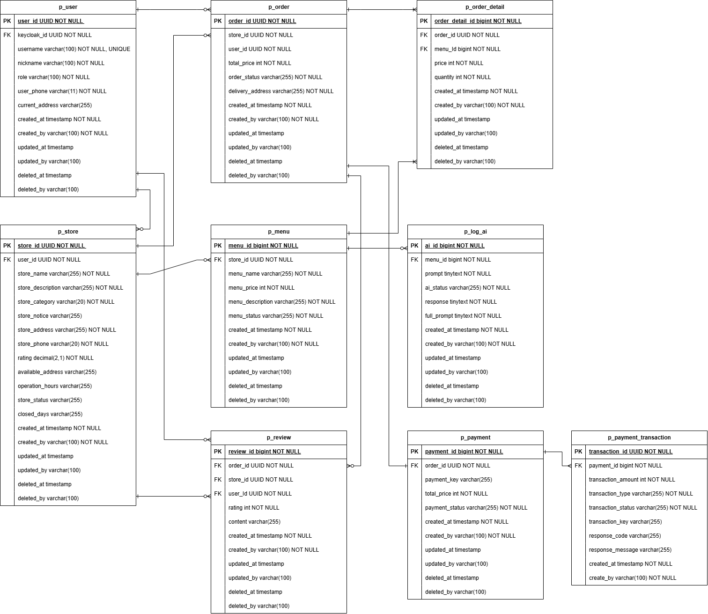

# DeliveryI

> **DeliveryI**는 AI 기술을 활용한 **음식 주문 및 가게 관리 플랫폼**으로,
> 고객, 점주, 관리자 모두가 효율적으로 주문 데이터를 관리하고,
> AI가 자동으로 메뉴 설명을 생성하는 등 **운영 효율성과 고객 경험을 향상시키는 것**을 목표로 합니다.

## 팀원 역할 분담

| 이름 | 담당 도메인 / 역할 | 주요 내용                                      |
|------|-------------------|--------------------------------------------|
| **김형섭** | 주문(Order), 가게(Store), 리뷰(Review) | 주문 생성/취소/상태관리, 리뷰 및 평점 관리, 가게 관리/조회 API 개발 |
| **이채은** | AI + Gemini API 연동, 메뉴(Menu) | 메뉴 CRUD, AI 메뉴 설명 자동 생성, AI 요청/응답 저장 로직 구현 |
| **이서현** | 회원(User) + Keycloak, 결제(Payment) | 회원 인증/인가, Keycloak 연동, 결제 기록 관리 및 JWT 통합   |

## 프로젝트 목적 및 상세

### 프로젝트 목적
> DeliveryI는 AI를 활용해 메뉴 설명 작성과 가게 운영을 자동화함으로써  
> 점주의 관리 부담을 줄이고, 고객에게는 신뢰도 높은 주문 경험을 제공하는 것을 목표로 합니다.

### 프로젝트 상세
- **AI 활용**: Google Gemini API로 메뉴 설명 자동 생성
- **인증/인가**: Keycloak을 통한 중앙 인증 관리 (JWT 통합)
- **주문 관리**: 실시간 주문 상태 추적, OWNER의 주문 프로세스 관리
- **리뷰 시스템**: 주문 완료 후 리뷰 작성 가능, 평균 평점 자동 계산
- **가게 관리**: 가게 등록 및 승인, 메뉴/공지 관리
- **보안**: HTTPS, Role 기반 접근 제어(CUSTOMER / OWNER / MANAGER / MASTER)

---

## 서비스 구성 및 실행 방법

### 1️. 사전 준비
| 항목                        | 내용                                      |
|---------------------------|-----------------------------------------|
| **JDK**                   | 21 이상                                   |
| **Spring Boot**           | 3.5.7                                   |
| **MySQL**                 | DB `deliveryi`                          |
| **Keycloak**              | 인증 서버 (ex: 포트 8080, Realm: `deliveryi`) |
| **Google Gemini API Key** | AI 설명 생성용 API 키 필요                      |


### 2️. 환경 변수 설정 
[application.yml](./src/main/resources/application.yml) 파일 참고하여 MySQL, Keycloak, Google Gemini API Key 등 세팅

### 3. 실행 방법
```bash

# 1. 프로젝트 클론
git clone https://github.com/DeliveryI/deliveryI.git
cd deliveryI

# 2. 빌드
./gradlew clean build

# 3. 실행
java -jar build/libs/deliveryI-0.0.1-SNAPSHOT.jar

```

## ERD 구조

> ERD 파일은 프로젝트 루트의 `/docs/erd.png` 에 위치합니다.



---

## 기술 스택

| 구분                  | 기술 / 도구                                                       | 설명                            |
| ------------------- |---------------------------------------------------------------| ----------------------------- |
| **Backend**         | `Java 21`, `Spring Boot 3.5.7`, `Spring Data JPA`, `QueryDSL` | 핵심 비즈니스 로직 및 데이터 계층 관리        |
| **Database**        | `MySQL (RDS)`                                                 | 영속 데이터 및 캐시 관리                |
| **Auth / Security** | `Keycloak`, `Spring Security`, `JWT`                          | 중앙 인증 서버(Keycloak)와 JWT 기반 인가 |
| **AI 연동**           | `Google Gemini API`                                           | 메뉴 설명 자동 생성 기능                |
| **Infra**           | `AWS EC2`                                                     | 클라우드 인프라 및 IaC 구성             |
| **CI/CD**           | `GitHub Actions`, `Docker`                                    | 빌드 및 배포 자동화                   |
| **Test / Docs**     | `JUnit5`, `Mockito`, `ArchUnit`, `Swagger`                    | 단위/통합 테스트 및 API 문서화           |
| **Security**        | `HTTPS (TLS)`, `CORS`, `Role 기반 접근 제어`                        | 안전한 통신 및 권한별 API 접근 제어        |

---

## API 문서 (API Docs)

> DeliveryI의 모든 API는 Swagger UI를 통해 자동 문서화됩니다.


🔗 Swagger UI URL: https://api11.sparta-project.xyz/swagger-ui/index.html